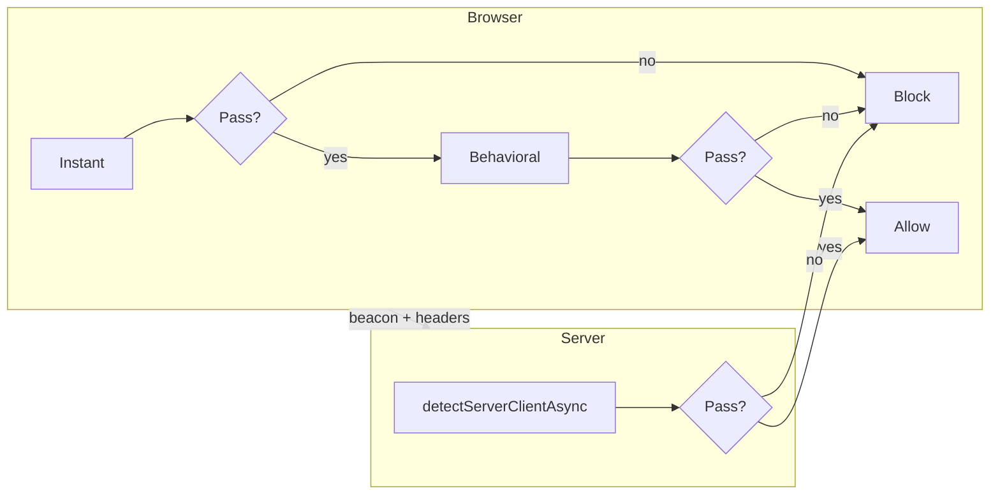

<div align="center">

# detect-bot-client

**Detect bots, headless browsers, and automation — in the browser and on the server.**

One library. Three layers of defense. Zero external API keys.

[](https://www.npmjs.com/package/detect-bot-client)
[](LICENSE)
[](https://nodejs.org)
[](https://github.com/okasi/detect-bot-client/actions/workflows/ci.yml)
[](https://github.com/okasi/detect-bot-client/actions/workflows/update-ip-data.yml)

[Quick start](#quick-start) · [Detection modes](#detection-modes) · [Signals](#signals) · [API](#api) · [Examples](#examples) · [FAQ](#faq)

</div>

---

## Why this library?

Most bot-detection snippets are copy-pasted checks that rot quickly. **detect-bot-client** gives you a maintained, typed, testable toolkit that covers the full stack:

**[Live demo](https://okasi.github.io/detect-bot-client/)** — run instant and behavioral checks in your browser.

| Layer | Runs where | Catches |
|-------|------------|---------|
| **Instant** | Browser (sync) | WebDriver, Selenium, Playwright, headless Chrome, bad WebGL/WebGPU |
| **Behavioral** | Browser (over time) | Robotic mouse/scroll/typing, synthetic events |
| **Server** | Node / edge | Datacenter IPs, AbuseIPDB, TLS fingerprint mismatch, timezone spoofing |

- **No API keys** — GeoIP and IP blocklists are bundled and updated weekly
- **TypeScript-first** — full types, ESM + CJS
- **Composable** — use one layer or combine all three
- **Explainable** — every flag has a name, weight, and confidence level

---

## Quick start

```bash
npm install detect-bot-client
```

### Browser — block automation on page load

```ts
import { detectInstantClient } from "detect-bot-client";

const result = detectInstantClient(window);

if (!result.isLegitClient) {
  window.location.href = "/blocked";
}
```

### Server — score a request in one call

```ts
import { detectServerClientAsync } from "detect-bot-client";

const result = await detectServerClientAsync({
  clientIp: req.ip,
  clientTimezone: req.headers["x-timezone"],
  userAgent: req.headers["user-agent"],
  tlsFingerprint: req.headers["x-ja3-hash"],
});

if (!result.isLegitClient) {
  return res.status(403).json({ signals: result.signals });
}
```

### Behavioral — catch scripted interaction

```ts
import { createBehavioralClientDetector } from "detect-bot-client";

const result = await createBehavioralClientDetector({ context: window }).observe(10_000);

if (!result.isLegitClient) {
  console.warn("Robotic behavior", result.suspicionScore);
}
```

---

## Detection modes



| Mode | API | Speed | Environment |
|------|-----|-------|-------------|
| **Instant** | `detectInstantClient` | Immediate | Browser |
| **Instant+** | `detectInstantClientAsync` | ~50ms | Browser (adds WebGPU check) |
| **Behavioral** | `createBehavioralClientDetector` | 5–30s | Browser |
| **Server** | `detectServerClientAsync` | ~1–5ms per IP | Node, edge |

### Instant

Runs synchronously against `window`. Async variant adds WebGPU `shader-f16` validation on Chromium.

```ts
const sync = detectInstantClient(window);
const async = await detectInstantClientAsync(window);
```

### Behavioral

Observes mouse, scroll, and keyboard events. Score: `1 - Π(1 - weight)` across triggered signals.

```ts
const detector = createBehavioralClientDetector({
  context: window,
  scoreThreshold: 0.55,
  onUpdate: (r) => console.log(r.suspicionScore),
});
await detector.observe(8_000);
```

### Server

Pass `clientIp` to auto-run GeoIP lookup, datacenter range check, AbuseIPDB blocklist, iCloud Private Relay check, TLS validation, and timezone comparison.

```ts
const result = await detectServerClientAsync({
  clientIp: req.ip,
  clientTimezone: req.headers["x-timezone"],
  tlsFingerprint: req.headers["x-ja3-hash"],
  userAgent: req.headers["user-agent"],
});
```

Bundled IP data is refreshed weekly. Run locally: `npm run update:ip-data`.

---

## Signals

### Instant (boolean flags)

Any suspicious flag fails `isLegitClient`.

| Flag | Triggers when |
|------|---------------|
| `isWebDriver` | `navigator.webdriver === true` |
| `isPhantomJS` | PhantomJS globals present |
| `isNightmare` | Nightmare.js marker |
| `isSelenium` | Selenium document markers |
| `isDomAutomation` | Chrome DOM automation globals |
| `isHeadless` | WebDriver or HeadlessChrome UA |
| `isSuspiciousResolution` | Screen < 136×170 |
| `isUserAgentValid` | UA does not start with `Mozilla/5.0 (` |
| `isWebGLSupported` | No WebGL context |
| `isModern` | Below Chrome 121 / Firefox 128 / Safari 16.4 |
| `isMissingChromeObject` | Chromium without `chrome.runtime` |
| `isSoftwareRenderer` | SwiftShader / llvmpipe WebGL |
| `isSuspiciousWindowDimensions` | No browser chrome + origin placement |
| `isEmptyPlugins` | Zero plugins on Chromium |
| `isAutomationArtifacts` | ChromeDriver / Playwright markers |
| `isSuspiciousWebDriverDescriptor` | Patched `navigator.webdriver` |
| `isShaderF16Supported` | Async — missing WebGPU `shader-f16` on Chromium |

### Behavioral (weighted)

| ID | Weight | Confidence | Description |
|----|--------|------------|-------------|
| `no-mouse-activity` | 0.20 | low | Clicks without mouse moves |
| `click-without-mouse-movement` | 0.35 | high | Click with no recent mouse path |
| `linear-mouse-movement` | 0.25 | medium | Straight path, uniform speed |
| `teleport-mouse` | 0.40 | high | Implausible cursor jumps |
| `linear-scroll` | 0.30 | medium | Uniform scroll deltas/timing |
| `linear-typing` | 0.35 | high | Robotic or superhuman intervals |
| `synthetic-events` | 0.50 | high | `isTrusted === false` |

### Server (weighted)

| ID | Weight | Confidence | Description |
|----|--------|------------|-------------|
| `timezone-mismatch` | 0.50 | high | Client TZ ≠ GeoIP TZ |
| `known-suspicious-tls` | 0.55 | high | JA3 matches Python/curl/Go/Java |
| `tls-user-agent-mismatch` | 0.50 | high | JA3 conflicts with User-Agent |
| `missing-tls-fingerprint` | 0.25 | medium | Browser UA without JA3 |
| `accept-language-geo-mismatch` | 0.20 | low | Accept-Language missing GeoIP country |
| `datacenter-browser-mismatch` | 0.35 | medium | Datacenter IP + browser UA |
| `abuse-listed-ip` | 0.60 | high | AbuseIPDB 30-day blocklist |
| `icloud-private-relay` | 0.15 | low | iCloud Private Relay egress |

**Bundled IP data:** `data/datacenter_ip_ranges.csv` (ipcat), `data/abuse_ip_db_30d_ips.csv` (AbuseIPDB), `data/icloud_private_relay_ip_ranges.csv` (Apple).

---

## API

```ts
import {
  // Browser — instant
  detectInstantClient,
  detectInstantClientAsync,

  // Browser — behavioral
  createBehavioralClientDetector,
  analyzeBehavioralSamples,

  // Server
  detectServerClient,
  detectServerClientAsync,
  enrichServerContext,
  lookupClientIpGeo,
  createIpListChecker,

  // Standalone checks
  isAutomationArtifacts,
  isSoftwareRenderer,
  isTimezoneMismatch,
  isTlsUserAgentMismatch,
  KNOWN_SUSPICIOUS_TLS_FINGERPRINTS,
} from "detect-bot-client";
```

### Server options

```ts
detectServerClientAsync(context, {
  dataDir: "./custom-data",
  lookupGeo: true,
  checkIpLists: true,
  timezoneToleranceMinutes: 60,
  scoreThreshold: 0.5,
  requireTlsFingerprint: false,
  suspiciousTlsFingerprints: [],
});
```

### Behavioral options

```ts
createBehavioralClientDetector({
  context: window,
  minObservationMs: 3_000,
  scoreThreshold: 0.55,
  pollIntervalMs: 1_000,
  onUpdate: (result) => {},
});
```

---

## Examples

### Defense in depth

```ts
const instant = detectInstantClient(window);
if (!instant.isLegitClient) block();

fetch("/api/beacon", {
  headers: { "X-Timezone": Intl.DateTimeFormat().resolvedOptions().timeZone },
});

const behavioral = await createBehavioralClientDetector({ context: window }).observe(10_000);
if (!behavioral.isLegitClient) challenge();

const server = await detectServerClientAsync({ clientIp: req.ip /* ... */ });
if (!server.isLegitClient) return res.status(403).end();
```

### Express middleware

```ts
import { detectServerClientAsync } from "detect-bot-client";

app.use(async (req, res, next) => {
  const result = await detectServerClientAsync({
    clientIp: req.ip,
    clientTimezone: req.headers["x-timezone"],
    userAgent: req.headers["user-agent"],
    tlsFingerprint: req.headers["x-ja3-hash"],
  });

  if (!result.isLegitClient) {
    return res.status(403).json({ signals: result.signals });
  }
  next();
});
```

### Next.js client guard

```tsx
"use client";
import { useEffect } from "react";
import { detectInstantClient } from "detect-bot-client";

export function BotGuard({ children }) {
  useEffect(() => {
    if (!detectInstantClient(window).isLegitClient) {
      window.location.href = "/blocked";
    }
  }, []);
  return children;
}
```

---

## FAQ

**Can client-side checks be bypassed?**  
Yes. Use instant + behavioral for friction; server detection for authoritative decisions.

**False positives?**  
Possible with privacy browsers, VPNs, iCloud Relay, corporate proxies, VMs. Tune `scoreThreshold`.

**How often is IP data updated?**  
Weekly (Mondays 04:00 UTC). Run `npm run update:ip-data` locally anytime.

**Works without bundlers?**  
Yes — ESM + CJS + types. Use with Vite, Webpack, Next.js, or `esm.sh`.

---

## Development

```bash
git clone https://github.com/okasi/detect-bot-client.git
cd detect-bot-client
npm install
npx patchright install chromium   # once, for browser tests
npm test                          # unit tests
npm run test:patchright           # real Chromium via patchright
npm run build
npm run build:site          # copy browser bundle into docs/ for GitHub Pages
```

Live demo: https://okasi.github.io/detect-bot-client/ (deployed from `docs/` on push to `main`).

**GitHub Pages setup (one time):** Settings → Pages → Build and deployment → **Deploy from a branch** → Branch: `gh-pages` / `/ (root)`.

### Publish to npm

npm package: **`detect-bot-client`** (verified available; distinct from older [`detect-bot`](https://www.npmjs.com/package/detect-bot)).

#### Step 1 — First publish (once, from your computer)

```bash
git clone https://github.com/okasi/detect-bot-client.git
cd detect-bot-client
npm install
npm run test
npm run build
npm login
npm publish --access public
```

#### Step 2 — Enable Trusted Publishing (for GitHub Actions)

1. https://www.npmjs.com/package/detect-bot-client → **Settings** → **Trusted publishing**
2. **GitHub Actions** → user `okasi`, repo `detect-bot-client`, workflow `publish.yml`
3. Save

#### Step 3 — Future releases via Actions

```bash
npm version patch
git push origin main --follow-tags
```

Or re-run **Actions → Publish npm → Run workflow**.

See [AGENTS.md](AGENTS.md) for architecture and contributor guidance.

## License

[MIT](LICENSE) © [okasi](https://github.com/okasi)

---

<div align="center">

**If this saved you time, consider starring the repo.**

[](https://github.com/okasi/detect-bot-client)

</div>
